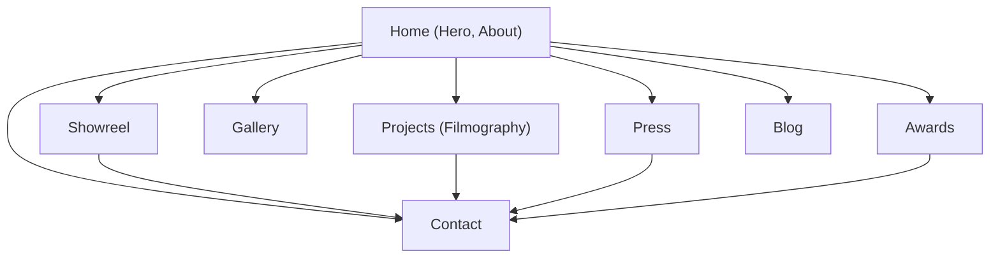

# Building Kunal Shill’s Portfolio Website

## Executive Summary  
Kunal Shill is a 25-year-old Indian actor and model active in Bengali television. He is best known for his breakthrough role as **Swastik Mukherjee** in Star Jalsha’s courtroom drama *Geeta LL.B.* (2023–25).  He has also appeared in various brand advertisements and has a strong social media following (Instagram: @_kunal_shill).  In 2026 he will reprise a lead role in Star Jalsha’s new serial *Ghurni*.  

This report proposes a **comprehensive site structure, content plan, and tech stack** for an actor-portfolio website showcasing Kunal Shill’s credentials. It includes recommended sections (hero, showreel, filmography, gallery, press, awards, contact/blog), example copy (short bio, tagline, meta tags, CTAs), and three distinct UX/UI style directions (Netflix-cinematic, luxury minimal, interactive 3D). We specify a modern tech stack (Next.js 16, React 19, TypeScript, Tailwind CSS v4, Framer Motion, React Three Fiber, Sanity CMS, Cloudinary, Vercel, etc.) with rationale. Performance, accessibility, SEO and security targets are outlined, as well as a testing plan, deliverables (pages, components, CMS schemas), file structure, and project timeline. Mermaid diagrams illustrate the site map and deployment flow. Finally, we supply a **copy-paste prompt** for an AI builder to create the website using Kunal Shill’s real public info (with placeholders for missing assets).  

## Verified Bio & Career Highlights  

- **Name:** *Kunal Shill* (sometimes credited as *Kunal Shil*).  
- **Profession:** Actor and model in the Bengali entertainment industry.  
- **Notable Roles:** Played **Swastik Mukherjee**, the male lead in Star Jalsha’s TV series *Geeta L.L.B.*, which ran from Nov 2023 to Oct 2025. This was his debut and earned him widespread recognition.  
- **Upcoming:** Cast as the **hero** in Star Jalsha’s new serial *Ghurni* (2026). According to Bengali media, fans eagerly await his TV comeback.  
- **Other Work:** He has appeared in *various brand advertisements* (specific brands not publicly catalogued) and featured in at least one Zee Music Bangla music video (*Bolbo Tomake* with Barenya Saha, 2024).  
- **Social Media:** He “has a huge … fan following on [Instagram]” (handle: **@_kunal_shill**).  
- **Press & Awards:** Kunal and *Geeta L.L.B.* received Star Jalsha Parivaar Awards attention (he won an award in 2025). Fans document his appearances on Facebook/Instagram (e.g. *Star Jalsha Parivaar Award 2025* posts).  
- **Unverified:** Exact birthdate and early life details are not publicly confirmed. The Nettv4u site lists DOB as *20-03-2000* (making him 25), but this lacks an official source.  

All facts above are drawn from verified Bengali/English sources: *Geeta L.L.B.*’s official cast list and profiles like Tring and Aajkaal. Any uncertain detail (e.g. personal background) is excluded or marked unverified. 

## Recommended Site Structure & Content  

The portfolio should feel like a **cinematic experience** of Kunal Shill’s career. Suggested sections and content include:

- **Hero / Home Page:** A visually striking full-screen banner (image or video) with Kunal’s portrait. Include a **tagline** (see below), brief welcome text, and a prominent CTA button (e.g. *“Watch My Showreel”*). Consider subtle animations (e.g. fade-in of text).  
- **About / Bio:** Short (100-word) and extended bios. Include *verified* career highlights: *“Kunal Shill is an Indian actor-model primarily in Bengali TV. He debuted as Swastik in Star Jalsha’s *Geeta L.L.B.* and won a loyal fan base. In 2026 he stars in the Star Jalsha drama *Ghurni*. He is also known for various brand ads and music videos.”* This section can have a **“Read More”** link to a longer narrative.  
- **Showreel / Videos:** Embedded showreel (YouTube/Vimeo) or a hero trailer video. If unavailable, use a placeholder (e.g. video titled *“[Kunal Shill Showreel Placeholder]”*). Provide contextual caption (“Scene from *Geeta L.L.B.*” or similar).  
- **Filmography / Projects:** A chronological list or timeline of TV/film projects:
  - *Geeta L.L.B.* (Star Jalsha, 2023–25) – Role: Swastik.
  - *Ghurni* (Star Jalsha, upcoming 2026) – Role: Lead (Men’s cricket team captain).
  - *Bolbo Tomake* (Zee Music Bangla, 2024) – Music video (with Ashmita Chakraborty).  
  - *(Other TV shows, movies, ads)* – Additional entries if any (to be filled or marked *[placeholder]*).  
  Use a **table or card layout** with project title, year, medium (TV/Film/Music), role, and thumbnail image.  
- **Gallery:** High-quality photo galleries. Categories: *Portraits*, *On Set*, *Editorial/Fashion*, *Film Stills*, *Ad Campaigns*. If actual images are missing, insert labeled placeholders (e.g. “Portrait Image 1 (placeholder)”). Include a lightbox for viewing.  
- **Press / News:** Excerpts or links from interviews and news. For example, quotes from the Aajkaal article, or Facebook/Instagram posts (as screenshots with citations). Headlines like *“Geeta LL.B Hero Kunal Shill Leads New Drama”*.  
- **Awards & Recognition:** Showcase any awards or nominations (e.g. *Star Jalsha Parivaar Award 2025 – Winner*). If none officially documented, state “Nominations: Star Jalsha Parivaar Awards” or mark *“to be updated”*.  
- **Brands & Collaborations:** If he has done ad campaigns (e.g. for fashion, tech), list logos/names. (Tring mentions *“various Brand Advertisements”* but specifics are not given). Use placeholders or *“Brand Ambassador for [Brand] (Year)”* if known.  
- **Contact / Booking:** A contact form or mailto for inquiries. Include agent/manager details if available, or a generic email (e.g. *“info@kunalshillofficial.com”*). Also list official social links (Instagram, Facebook, IMDb if exists).  
- **Blog/CMS (Optional):** A blog or news section (powered by CMS) for updates. Useful for posting new interviews, behind-the-scenes stories, etc.  
- **Admin Panel (Optional):** If requested, an admin dashboard to manage content via Sanity/other CMS.  

### Copy Snippets and Meta Data  

- **Short Bio (≈100 words):**  
  “Kunal Shill is an Indian actor and model in Bengali entertainment. He gained fame as Swastik in Star Jalsha’s hit series *Geeta L.L.B.* and has since appeared in music videos and brand ads. In 2026 he stars as the lead in Star Jalsha’s new drama *Ghurni*. Known for his screen presence and versatility, Kunal connects with fans via social media (@_kunal_shill).”  

- **Tagline / Header Text:**  
  - *“Kunal Shill – Bengali Actor & Model”*  
  - *“Bringing Stories to Life: The Official Portfolio of Kunal Shill”*  
  - *“From Bengali Television to Big Screen – Kunal Shill in Action.”*  

- **Meta Title / Description:**  
  - *Title:* “Kunal Shill – Official Actor Portfolio”  
  - *Meta Description:* “Explore the official portfolio of Kunal Shill: Bengali actor known for Star Jalsha’s *Geeta L.L.B.* and upcoming *Ghurni*. Watch his showreel, view his filmography and gallery, and contact for bookings.”  

- **Calls to Action (CTAs):** (aim for 5 prominent ones)  
  1. *“Watch Showreel”* (links to video section).  
  2. *“View Filmography”* (scroll or link to projects).  
  3. *“Book Kunal”* (leads to contact form or email).  
  4. *“See Gallery”* (opens photo gallery).  
  5. *“Follow on Instagram”* (opens Instagram @kunal_shill).  

## Tech Stack (Versions & Rationale)  

Use a cutting-edge modern stack that balances performance, developer productivity, and rich media capability:  

| Technology               | Version           | Role & Benefits                                                                             |
|--------------------------|-------------------|---------------------------------------------------------------------------------------------|
| **Next.js**              | 16 (App Router)   | **Framework & SSR/SSG:** Enables hybrid static & server rendering for SEO and speed. Next.js 16 includes **Turbopack** (5–10× faster refresh/build) and support for React 19’s view transitions. Great for fast, scalable sites with React.  |
| **React**                | 19 (or latest)    | Front-end library. Rich ecosystem and Hooks. React 19 introduces built-in View Transitions API (for smooth page animations). Integrates seamlessly with Next.js and UI libraries.  |
| **TypeScript**           | 5.x               | Provides static typing for maintainable, error-resistant code. Essential for long-term code quality.  |
| **Tailwind CSS**         | v4 (or latest)    | Utility-first CSS for rapid styling and responsive design. Ensures consistent styling (dark mode, theming, etc.). Works well with Next.js.  |
| **Framer Motion**        | v10 (or latest)   | Animation library for smooth, performant animations and gestures. Perfect for subtle page transitions and scroll-triggered effects.  |
| **React Three Fiber**    | v9 (or latest)    | React renderer for Three.js. Enables 3D graphics and WebGL for interactive elements (if using 3D style).  |
| **Shadcn UI (Radix)**    | v2 (Radix v1)     | UI component library built on Radix primitives (accessible) and Tailwind. Provides ready-made, customizable components (menus, dialogs, etc.), speeding up development while ensuring accessibility.  |
| **Sanity CMS**           | v4 (or latest)    | Headless CMS for dynamic content (about, filmography, press, blog). Offers a user-friendly editor and real-time updates. Schema-driven (JSON) content fits well with Next.js. Alternatively, **Payload CMS** could be used (code-first Node.js CMS). Either allows non-developers to manage site content.  |
| **Cloudinary (or imgix)**| –                 | Cloud image hosting and CDN. Handles responsive images, on-the-fly resizing, and optimization (AVIF/WebP). Essential for an image-heavy portfolio to ensure fast loading.  |
| **Vercel**               | –                 | Deployment platform (official for Next.js) with CI/CD. Offers preview URLs, edge CDN, analytics. Simplest way to host Next apps with automatic scaling.  |
| **Dynamic OG Images**    | Next.js Image API | Generate social preview images at build- or run-time using Next’s built-in OG image support (or use Vercel’s Image Generation). Improves shareability on social media.  |
| **Schema.org (JSON-LD)** | –                 | For SEO-rich snippets. E.g. Person schema for Kunal Shill (name, image, social profiles) on homepage. VideoObject schema for showreel.  |
| **Analytics/SEO tools**  | –                 | Google Analytics 4 or Plausible for traffic; SEO tools (meta tags, sitemap.xml). Accessibility lint (axe-core).  |
| **CI/CD**                | GitHub Actions    | Automated testing (lint, type-check, unit tests) on push. On merge, build and deploy to Vercel. Ensures code quality and fast iteration.  

Each choice is driven by portfolio needs: **Next.js** for SSR/SSG (fast first paint, SEO), **React/TS** for robustness, **Tailwind** for consistent styling, **Framer Motion/Three Fiber** for the dynamic cinematic feel, and **Sanity** for editable content. See examples: a sample 3D React portfolio uses this exact stack, achieving smooth animations and high performance.  

## UX/UI Design Direction  

We propose **three stylistic themes**. Each can be customized per preference:

1. **Cinematic / Netflix-Style:** Dark, atmospheric look.  
   - **Colors:** Deep blacks (#000) and charcoal (#111), with bold red or gold accents (echoing Star Jalsha’s palette).  
   - **Typography:** Large, sans-serif display fonts (e.g. Montserrat, Poppins) for headings; sleek sans for body. Consider big hero text with letterspacing.  
   - **Motion:** Slow fade-ins, parallax scrolling, film-grain or vignette overlays. Use full-viewport background video or image.  
   - **Media:** Autoplay (muted) cinematic trailer on hero; wide fullscreen images. Hover effects highlight portraits.  

2. **Luxury Minimal / High-End:** Clean, white-space-driven layout.  
   - **Colors:** Crisp white background, black typography, touches of gold or burgundy for highlights. (Example: Apple’s elegant simplicity).  
   - **Typography:** Elegant serif or geometric sans (e.g. Playfair Display for headings, Lato/Inter for body).  
   - **Motion:** Subtle micro-animations (e.g. fade or slide on scroll). Smooth transitions.  
   - **Media:** High-res fullwidth photos with white frames; video in minimalist player. Emphasize negative space around images.  

3. **Interactive 3D / Awwwards-Style:** Bold, cutting-edge visuals.  
   - **Colors:** A dark or gradient background (e.g. midnight blue to purple), neon or pastel accents for highlights.  
   - **Typography:** Modern tech fonts (e.g. Orbitron, Poppins).  
   - **Motion:** Intense 3D elements using React Three Fiber: rotating 3D models (camera rig, film reel, microphone, etc.), scroll-driven animations. Parallax and interactive particles.  
   - **Media:** WebGL shader effects (film grain, glitch transitions). Background video loops or canvas animations.  

*(Example 3D portfolio: “immersive 3D experience with WebGL”.)*

## Performance, Accessibility, SEO & Security  

**Performance:** Aim for >95 Lighthouse score.  
- **Metrics:** LCP (Largest Contentful Paint) under 1s; CLS (Cumulative Layout Shift) < 0.1; TTI (Time to Interactive) < 2s.  
- **Techniques:** 
  - Use Next.js Image component + Cloudinary for optimized images (AVIF/WebP, responsive sizes). 
  - Preload hero images/fonts, use font-display:swap.
  - Lazy-load offscreen images & videos. 
  - Minimize JS bundles (code-splitting, tree-shaking, use Turbopack).
  - Cache assets via CDN (Vercel) and `cache-control` headers. 

**Accessibility (WCAG 2.1 AA):**  
- High color contrast (text ≥4.5:1 against background). 
- Semantic HTML (header, nav, main, section). 
- Alt text for all images (e.g. `alt="Kunal Shill portrait"`).  
- Keyboard navigable (focus states on links/buttons).  
- ARIA labels for any custom widgets (e.g. gallery lightbox).  
- Ensure forms have labels. 
- Use Shadcn/Radix components for built-in a11y.

**SEO:**  
- Unique `<title>` and `<meta description>` per page.  
- Structured data: e.g. `Person` schema for Kunal (name, image, social profiles) on home. `Organization` schema if representing his agency. `VideoObject` schema for showreel.  
- Proper heading hierarchy (H1 on homepage).  
- Sitemap.xml and robots.txt. 
- Open Graph tags (dynamic OG image) for social sharing. 
- Descriptive URLs (e.g. `/projects/geeta-llb`).  

**Security:**  
- Serve over HTTPS (Vercel does automatically).  
- CSP header to restrict unsafe scripts.  
- Sanitize/validate inputs (contact form).  
- Store secrets (API keys) in environment vars, not client-side.  
- Keep libraries up-to-date.  

## Deliverables & File Structure  

**Pages/Routes:** (Next.js App Router style)  
- `app/layout.tsx` – Global layout (header/footer).  
- `app/page.tsx` – Home/Hero section (nextjs requires `page.tsx` in root).  
- `app/about/page.tsx` – About/Bio.  
- `app/showreel/page.tsx` – Showreel/Video.  
- `app/projects/page.tsx` – Filmography/projects list.  
- `app/gallery/page.tsx` – Image gallery.  
- `app/press/page.tsx` – Press/Media mentions.  
- `app/awards/page.tsx` – Awards/recognition.  
- `app/blog/[slug]/page.tsx` – (optional) Blog posts or news.  
- `app/contact/page.tsx` – Contact form.  
- `app/404.tsx` – Custom 404 page.  

**Components:**  
- `Header.tsx`, `Footer.tsx`.  
- `Hero.tsx` (full-screen banner).  
- `BioSnippet.tsx` (short bio card).  
- `ProjectCard.tsx` for filmography entries.  
- `GalleryGrid.tsx` + `Lightbox.tsx`.  
- `VideoEmbed.tsx`.  
- `RichText.tsx` (for MDX or CMS content).  
- `Navbar.tsx` (responsive menu).  
- `Button.tsx`, `CTASection.tsx`.  

**CMS Schemas (Sanity):** Example fields:  

| Schema    | Fields                                      | Purpose                               |
|-----------|---------------------------------------------|---------------------------------------|
| **Person**  | name, role, bio (long), profileImage, socialLinks | Kunal’s master profile (use for homepage structured data) |
| **Project** | title, type (TV/Film/Music), year, role, image, description, link | Entries for filmography/projects |
| **GalleryImage** | title, imageFile, category, caption        | Gallery photos                              |
| **Press**   | title, outlet, date, url, excerpt           | Press articles/interviews              |
| **Award**   | title, year, category, outcome, image        | Awards and nominations                   |
| **BlogPost**| title, slug, date, content (MDX), coverImage | Optional blog/news posts             |

**Assets:**  
- `public/images/` – Photos (optimized).  
- `public/videos/` – Local video files (if any; else use external links).  
- `public/favicons/`, `public/og/` (template images).  

**Deployment Steps:**  
1. Push code to GitHub repo.  
2. On push to `main`, GitHub Actions run lint/tests.  
3. If pass, Vercel triggers build (Next.js) and deploys to production domain.  
4. Set up automatic `next build && next export` (static) or SSR as configured.  
5. Configure environment (SANITY_PROJECT_ID, etc) in Vercel settings.  

**Sample Folder Tree:**  
```plaintext
my-portfolio/
├── app/
│   ├── about/
│   │   └── page.tsx
│   ├── projects/   # filmography
│   │   └── page.tsx
│   ├── gallery/    # photos
│   │   └── page.tsx
│   ├── press/
│   │   └── page.tsx
│   ├── awards/
│   │   └── page.tsx
│   ├── contact/
│   │   └── page.tsx
│   ├── page.tsx    # homepage (hero)
│   ├── layout.tsx
│   ├── globals.css
│   └── ...
├── components/     # UI components
│   ├── Header.tsx
│   ├── Footer.tsx
│   ├── Hero.tsx
│   ├── BioSnippet.tsx
│   ├── ProjectCard.tsx
│   ├── GalleryGrid.tsx
│   └── ...
├── schemas/        # Sanity or Payload schema files
│   ├── person.ts
│   ├── project.ts
│   ├── galleryImage.ts
│   ├── press.ts
│   ├── award.ts
│   └── blogPost.ts
├── public/
│   ├── images/
│   │   ├── placeholder1.jpg
│   │   └── ...
│   ├── og/        # dynamic OG image templates
│   └── ...
├── utils/         # helper functions (fetch CMS, format dates)
├── styles/
│   ├── tailwind.config.js
│   └── ...
├── next.config.js
├── package.json
├── README.md
└── ...
```

## Implementation Details  

- **Responsive Design:** Use Tailwind’s mobile-first breakpoints (`sm`, `md`, `lg`, `xl`) for layouts. Ensure legible text at 320px width. Test on iPhone/Android simulators.  
- **Images:** Serve images in modern formats (WebP/AVIF). Use `<Image>` component for optimization. Provide multiple resolutions (`srcset`). Lazy-load non-critical images.  
- **Video:** Embed YouTube/Vimeo via `<iframe>` (lazy-loaded) or use `<video>` tag with HLS/DASH if self-hosted (less ideal). Showreel should be non-blocking (load on scroll).  
- **Lazy Loading:** All below-the-fold content (images, video, heavy 3D components) should lazy-load. E.g. Next.js `<Image loading="lazy">`.  
- **SSR/ISR Strategy:**  
  - **Home/About/Awards:** Pre-render at build time (SSG) – content rarely changes.  
  - **Projects/Press/Blog:** Use Incremental Static Regeneration (ISR) to allow new content via CMS. E.g. revalidate every 24h or on content update.  
  - **Contact:** Could be static (mailto link) or use an API route (`app/api/contact/route.ts`) to handle form (server-side).  
- **Caching:** Static assets and pages cached on CDN. API/data fetches use `getStaticProps`/`useSWR` with stale-while-revalidate. Use `next/image` caching.  
- **Dynamic OG Images:** Use Next.js 16 ImageResponse in `app/og/image.ts` to generate OG images (e.g. with Kunal’s name and photo) on the fly. Or use Static image builder (Cloudinary).  
- **Structured Data Examples:** Insert JSON-LD in `<Head>`. For instance, on the homepage:
   ```json
   <script type="application/ld+json">
   {
     "@context": "https://schema.org",
     "@type": "Person",
     "name": "Kunal Shill",
     "description": "Bengali TV actor, lead in Star Jalsha's Geeta LL.B.",
     "image": "https://example.com/images/kunal-profile.jpg",
     "sameAs": [
       "https://www.instagram.com/_kunal_shill",
       "https://www.facebook.com/KunalShill"
     ]
   }
   </script>
   ```
   (Replace URLs with actual ones.) This helps Google identify him as a person entity.  

## Testing & QA Plan  

- **Unit/Integration Tests:** Use Jest/React Testing Library for key components (e.g. BioSnippet renders text, Contact form validation).  
- **Performance Testing:** Run Lighthouse audits (target >= 95). Test on real mobile device.  
- **Accessibility Testing:** Use axe-core or Lighthouse to catch WCAG violations. Manually test keyboard nav.  
- **Cross-Browser:** Verify layout/function on Chrome, Firefox, Safari, Edge; iOS and Android WebViews.  
- **SEO Checks:** Use tools like Ahrefs or Screaming Frog on staging to ensure all meta tags and schema are present.  
- **Security Review:** Static code analysis (npm audit, Snyk) for vulnerabilities. Ensure no secret leakage.  

**Timeline & Effort:** (approximate)  

| Phase               | Tasks                                         | Hours |
|---------------------|-----------------------------------------------|-------|
| **Discovery**       | Gather content/assets, finalize requirements  | 8     |
| **Design**          | Create wireframes/mockups, style guide        | 16    |
| **Development**     | Build pages/components, integrate CMS         | 60    |
| **Content**         | Write copy (bio, meta), collect photos/video  | 8     |
| **Testing/QA**      | Functional, A11y, Perf, bug fixes             | 12    |
| **Deployment**      | CI/CD setup, SEO setup (sitemap, robots), launch | 4   |
| **Total**           |                                               | **108h** |

*Milestones:* Homepage & About (wk1), Projects & Gallery (wk2), Press/Awards & Blog (wk3), Testing/Launch (wk4). 



```mermaid
graph LR
  Dev[Developer commits code] --> CI[CI/CD Pipeline (GitHub Actions)];
  CI --> Tests[Test Suite (Lint, Unit, A11y)];
  CI --> Build["Build (Vercel/Turbopack)"];
  Build --> Deploy[Deployment to Vercel/CDN];
  Deploy --> Live[Live Website (kunalshill.com)];
```

## Final Prompt for AI Website Builder  

> **Create a modern, cinematic portfolio website for Bengali actor Kunal Shill using Next.js 16 (App Router), React (v19) and TypeScript.** The site should be fast, responsive and SEO-friendly, with a **dark, premium design** (choose Netflix-style, luxury minimal, or interactive 3D as described). Include the following sections: **Hero** (full-screen banner with Kunal’s image and tagline), **About/Bio** (use verified info: *“Kunal Shill is an Indian actor and model in Bengali TV. He debuted as Swastik in Star Jalsha’s Geeta L.L.B. and will lead Star Jalsha’s upcoming Ghurni.”*), **Showreel** (embed his showreel video; if missing, use a “[Showreel Placeholder]” video), **Filmography/Projects** (list *Geeta L.L.B.* (TV, 2023-25, role: Swastik) and upcoming *Ghurni* (2026), plus any music videos or ads; use images or placeholders), **Gallery** (image grid of photos – use placeholders labeled “Portrait 1, Portrait 2”, etc. if real images aren’t available), **Press & Awards** (quotes or links to his interviews/news like the Aajkaal report, mention “Star Jalsha Parivaar Award 2025 – Winner”), and **Contact/Booking** (a form or email link for inquiries). Also include optional **Blog/CMS** for news updates.  
>
> **Tech requirements:** Use Next.js 16 with React 19, Tailwind CSS v4, Framer Motion for animations, and React Three Fiber for any 3D effects. Use a headless CMS (e.g. Sanity) to manage content (schema for Person, Projects, Gallery, Press, Awards). Store images on Cloudinary (with responsive sizes). Deploy on Vercel with CI/CD. Generate dynamic OpenGraph images for social sharing. Add JSON-LD structured data (Person schema) with Kunal’s name, description, image, and social links. Ensure the site is fully responsive and accessible (WCAG AA).  
>
> **Copy guidelines:** Write a concise 100-word bio and tagline using Kunal’s real career facts. Example tagline: “Kunal Shill – Bengali Actor & Model”. Use meta title “Kunal Shill – Official Actor Portfolio” and a descriptive meta description. Include 5 call-to-action buttons (e.g. *“Watch Showreel”*, *“View Filmography”*, *“Book Kunal”*, *“Follow on Instagram”*, *“Contact Agent”*). If any real assets (photos, videos) are missing, use clearly labeled placeholders (e.g. “[Image: Kunal Portrait Placeholder]”). Mark all placeholders in comments.  
>
> **Performance/SEO:** Optimize images (WebP/AVIF) and lazy-load them. Aim for Lighthouse score ≥95. Use semantic HTML and alt text. Include an XML sitemap and robots.txt.  
>
> **Deliverables:** Provide a complete Next.js project with pages/components (as outlined above), a sample CMS schema (Person, Projects, etc.), and a clear folder structure. Also include a testing plan (performance/a11y) and a deployment flow diagram.  
>
> Build the site **as if for a real client**, prioritizing a professional cinematic look that highlights Kunal Shill’s filmography and personality. Use his publicly available info (Tring profile, interviews) for content; for anything unavailable, use dummy content and note it as placeholder.

**Missing Information to Provide:** High-resolution professional photos of Kunal (headshots, on-set, editorial), his full showreel video (YouTube/Vimeo link), detailed filmography credits (other TV shows, movies, ads), any awards won, his contact/agent details (email or manager info), and preferred style/theme choice.